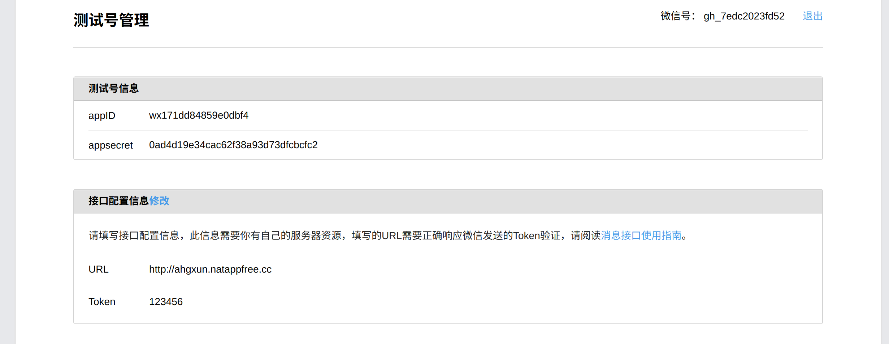
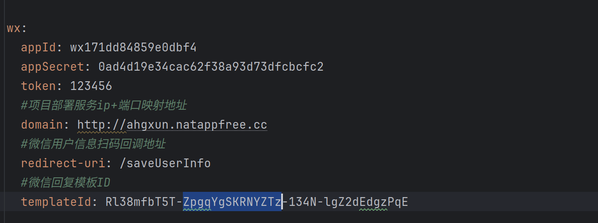
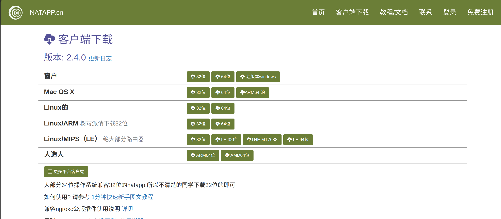

1.选择ai-assistant目录，用idea作为一个项目打开

2.在application.yml选择开发环境配置文件或生产环境配置文件,并根据需要修改配置文件

如果是开发环境,如果是spring.profile.active属性值配置dev,生产环境就配置prod

开发环境配置文件：application-dev.yml
生产环境配置文件：application-prod.yml

配置微信公众号参数信息（因为此处只完成测试接口的配置，此处说明接口测试的配置方法）
2.1 访问 https://mp.weixin.qq.com/
2.2 点击服务号开发文档，来到开始开发，接口测试号申请，微信扫码登录，来到以下界面

2.3 赋值appId,secret,token参数到本地application-dev.yml配置文件中wx下面对应参数位置

3.为了微信服务器能找到本地运行服务的地址，我们需要使用到内网穿透，可以使用natapp进行免费的内网穿透，不好的是需要经常更换地址，比较麻烦
以下是natapp地址：https://natapp.cn/

3.1 访问natapp地址，根据自己的操作系统下载对应的客户端，

注册登录之后来到 `我的隧道` 选项卡

3.2 找一个目录存放我们下载的客户端，目录路径不要有中文

3.3 我们刚下载的natapp文件可能没有执行权限，可以切换到管理员账号，为改文件赋权限
chmod 777 natapp
3.4 回到natapp配置想要被公网访问的端口，就是配置本地springboot服务的运行端口。

3.5 赋值authtoken 我的隧道的值，来到本地natapp文件夹目录下，在改文件夹下打开终端。输入启动命令启动natapp
启动命令
./natapp -authtoken 自己隧道authtoken的值
出现以下界面，则启动成功

3.6 复制公网路径，来到配置文件，在wx.domain的值位置粘贴
3.7 启动项目本地springboot项目
3.8 来到微信公众测试号，在接口配置信息中的URL填写公网地址，如图所示

3.9 复制域名（就是公网地址去掉http://部分），来到js接口安全域名，修改域名，把刚才的域名粘贴到里面，提交。

3.10 来到网页服务，网页账号，同样的修改域名

4.启动前端项目
前端：项目目录是ai-assistant-web目录
node 版本是 20.10.1
npm 版本是 10.2.3

定位到ai-assistant-web目录下，打开终端，执行npm install 安装模块
可以点开ai-assistant-web目录下的package.json文件,点击左侧serve边上绿色按钮进行启动

也可以在ai-assistant-web目录下值执行npm install 安装模块之后，再npm run serve启动

####注意
希望以后团队成员在开发本项目的时候，不要修改generator下面的文件，或者在里面mapper,service里面添加接口和对应的方法，可以在custom文件夹下建立类似generator的结构，因为这个目录使用mybatis-plus生成的，
当我们修改表数据，重新生成对应文件的时候，你写的方法就没有了。这种方法在我们发现数据库表设计不合理重新设计的时候比较方便。

