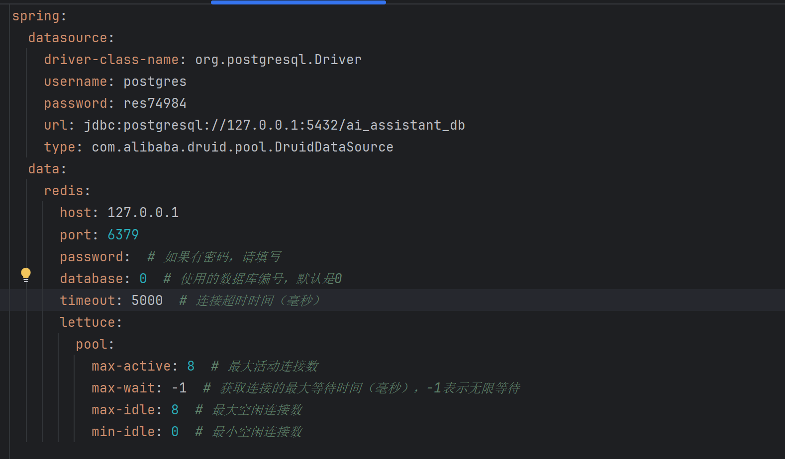

1.选择ai-assistant目录，用idea作为一个项目打开

2.配置文件中，更改为自己的数据库配置，启动本地Redis

3.本地部署需要使用到内网穿透，可以使用natapp进行免费的内网穿透，不好的是需要经常更换地址，比较麻烦

3.启动项目
前端：项目目录是ai-assistant-web目录
可以点开ai-assistant-web目录下的package.json文件,点击左侧serve边上绿色按钮进行启动

也可以在ai-assistant-web目录下值执行npm install 安装模块之后，再npm run serve启动

后端，
配置完数据源之后，并配置参数，即可启动项目

#注意
希望以后团队成员在开发本项目的时候，不要修改generator下面的文件，或者在里面添加可执行的方法，可以在custom文件夹下建立类似generator的结构，因为这个目录使用mybatis-plus生成的，
当我们修改表数据，重新生成对应文件的时候，你写的方法就没有了。这种方法在我们发现数据库表设计不合理重新设计的时候比较方便。

